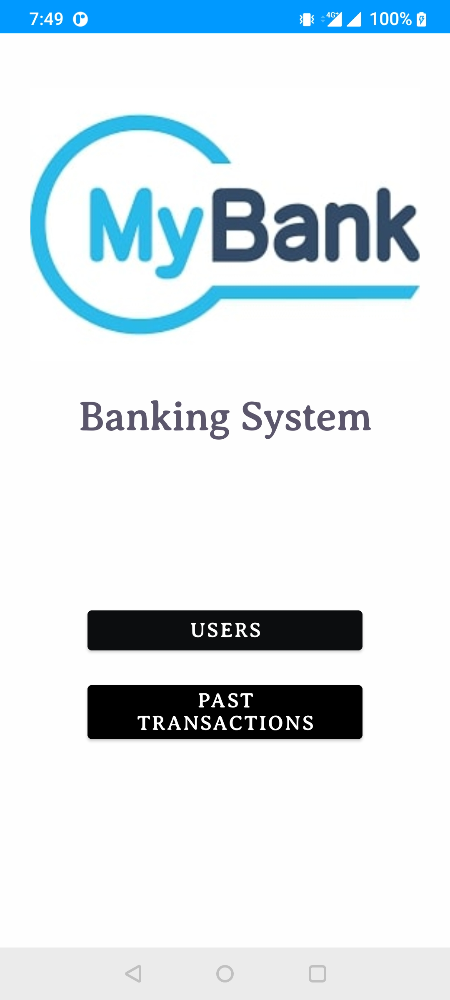
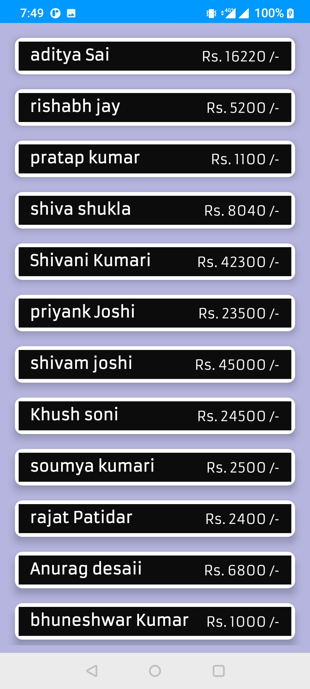
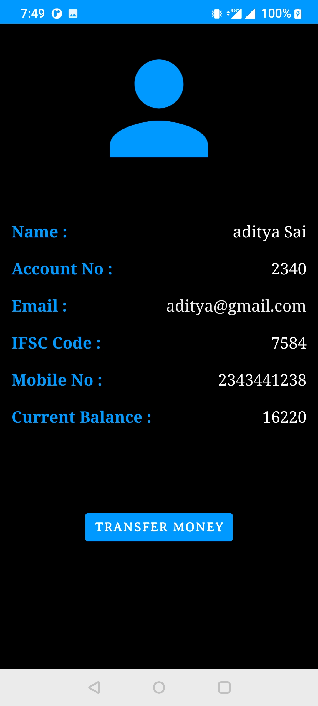
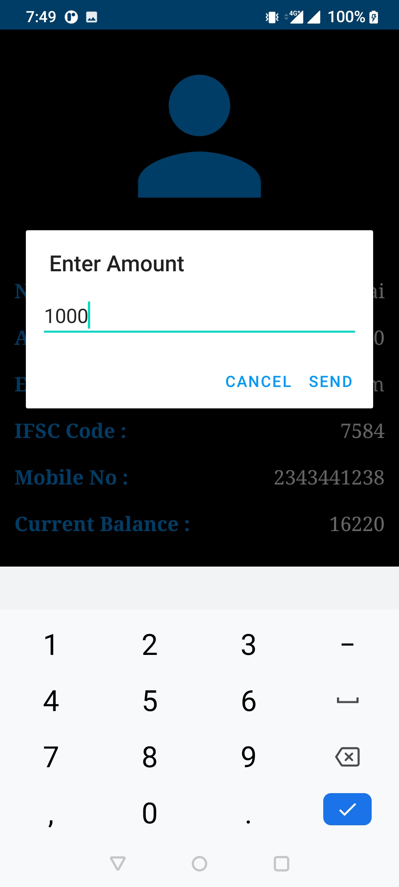
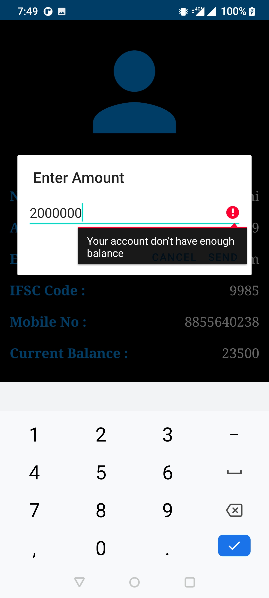
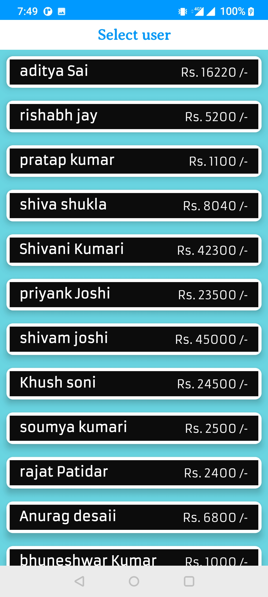
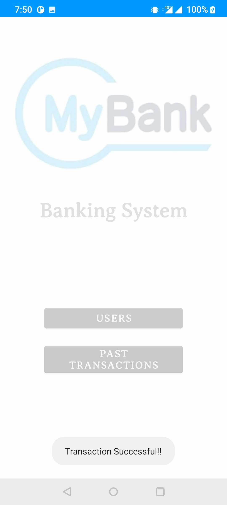
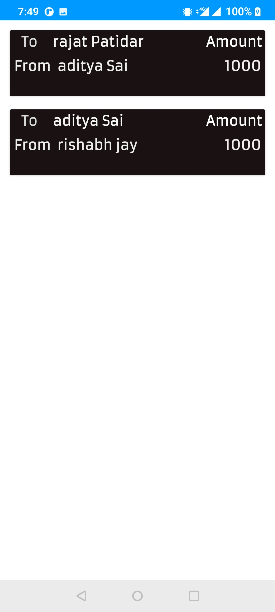

# NEERAJ-BANKING-APP
 
<h1>Home screen</h1> 
 
 <h1> User list </h1>

 <h1> User detailed information </h1>

 <h1> Transaction dialog / dialog error </h1>
       

 <h1> Select user to transfer amount </h1>

 <h1> Successfull transaction </h1>

 <h1> Past transaction history </h1>

